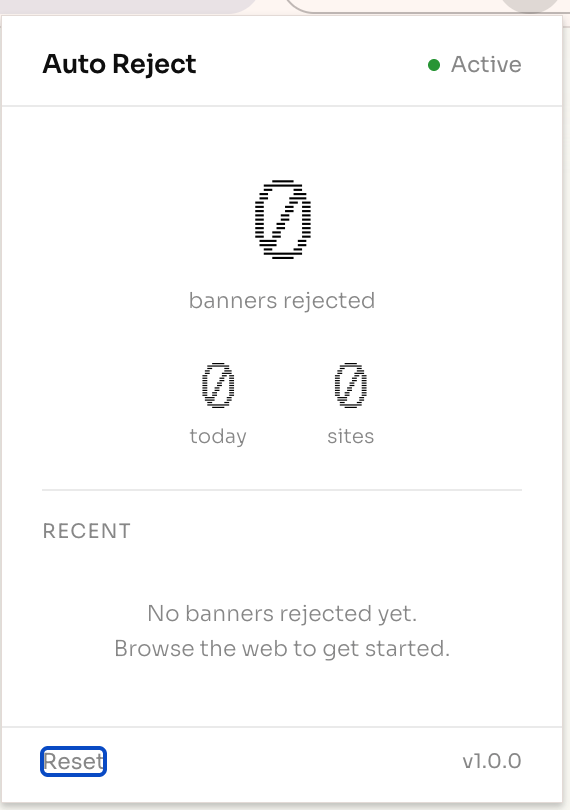
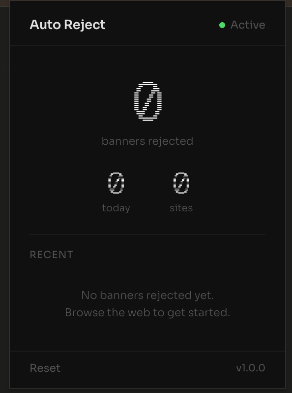
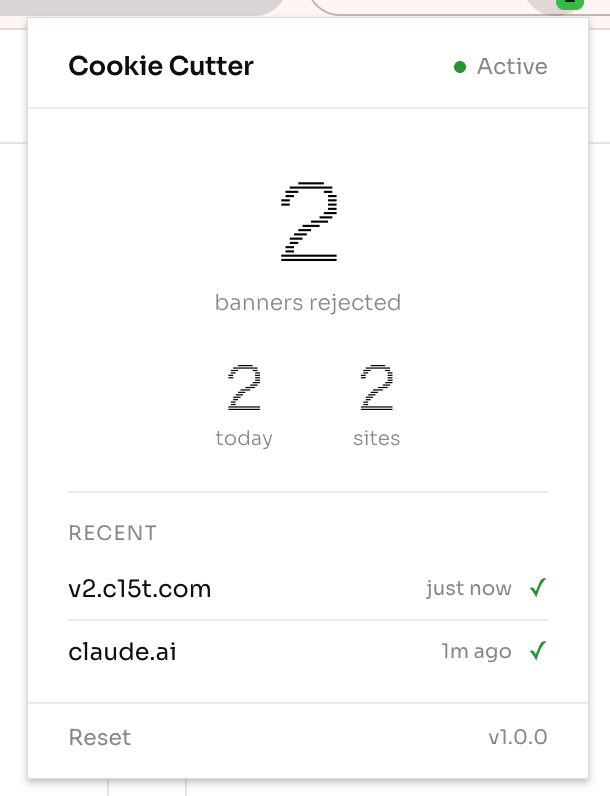
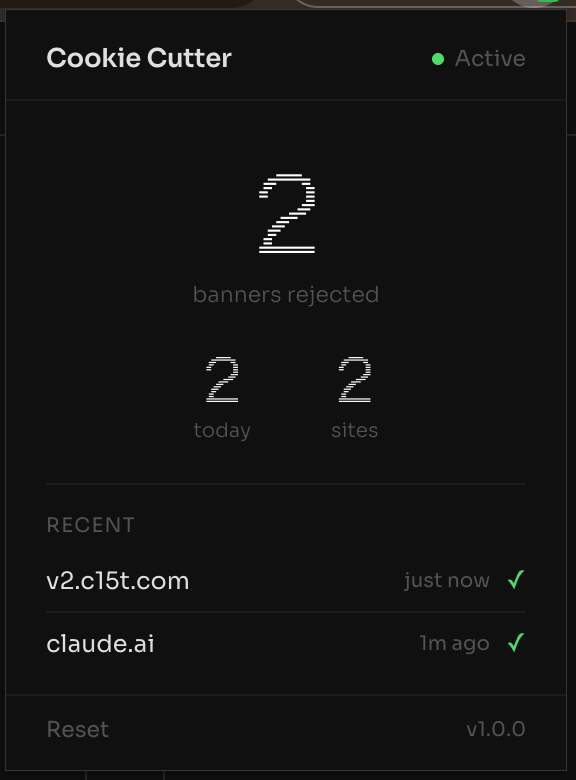
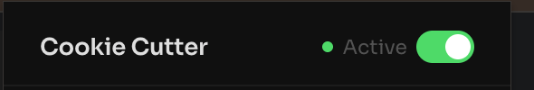

# Cookie Cutter

A Chrome extension that automatically finds and clicks "Reject All" / "Decline" buttons on cookie consent banners, so you never have to deal with them yourself.

## Screenshots

| Light | Dark |
|-------|------|
|  |  |
|  |  |

## How it works

1. A content script runs on every page and scans for known cookie banner patterns (OneTrust, Cookiebot, Didomi, Quantcast, and 40+ others)
2. When a banner is found, it locates the reject/decline button by CSS selector or text content and clicks it
3. If no reject button is found within 15 seconds, the site is logged as a failure so you know where manual action is needed
4. Stats are tracked per-site and shown in the popup

## Install

1. Clone or download this repo
2. Open Chrome and go to `chrome://extensions`
3. Toggle **Developer mode** ON (top-right)
4. Click **Load unpacked** and select this folder
5. The extension icon appears in your toolbar

## Features

- Rejects cookie banners automatically on page load
- Supports 40+ consent management platforms (CMPs)
- Descends into open shadow roots to find banners in web components
- Merges a community-maintained rules list (`rules.json`) fetched daily from this repo
- One-click "Report" on failed sites opens a pre-filled GitHub issue
- Per-site pause/resume from the popup
- Hides uncloseable banners and restores scroll as a last resort
- Sends the Global Privacy Control signal (`Sec-GPC: 1` header and `navigator.globalPrivacyControl`)
- Keyboard shortcut to toggle on/off (default `Alt+Shift+C` on Windows/Linux, `⌘⇧Y` on macOS; rebind at `chrome://extensions/shortcuts`)
- Export stats as JSON or CSV
- Tracks per-site rejection counts; shows failed rejections so you know which sites need manual action
- Light/dark theme follows your OS preference
- On/off toggle switch to enable or disable the extension
- Minimal, clean popup UI

## Contributing a CMP rule

If a site isn't being handled, the fastest way to fix it for everyone is to add an entry to [`rules.json`](rules.json) and open a PR. The schema is:

```json
{
  "version": 1,
  "bannerSelectors": ["#my-cmp-container"],
  "rejectButtonSelectors": ["#my-cmp-reject-all"],
  "rejectTexts": ["alle ablehnen"]
}
```

Overly broad selectors (`*`, `body`, `html`, anything with `:has(` or `iframe`) are rejected by the client at load time. Clicking "Report" on a failed site in the popup opens a prefilled issue so you don't have to type any of this.

## Changelog

### v1.2.0

**Community rules, GPC, shortcuts, and more control**

- Shadow DOM traversal (open roots) for banners inside web components
- Community rules: fetches and merges `rules.json` from the repo every 24h with strict validation
- Report failed sites directly to GitHub Issues from the popup (hostname, UA, and version only — no tab URL, no PII)
- Per-site pause/resume ("Pause here" / "Resume") from the popup
- Last-resort banner hiding after 15s if rejection fails, with body-overflow restoration (toggle in popup)
- Global Privacy Control: sends `Sec-GPC: 1` request header and sets `navigator.globalPrivacyControl = true`
- Keyboard shortcut to toggle on/off (default `Alt+Shift+C` on Windows/Linux, `Command+Shift+Y` on macOS; rebind at `chrome://extensions/shortcuts`)
- Export stats as JSON or CSV
- New permissions: `declarativeNetRequest` (for the GPC header) and `tabs` (for per-site pause)

### v1.1.0

**On/off toggle switch**



- Added on/off toggle switch in the popup header to enable or disable the extension
- Badge shows "OFF" when disabled
- Content script respects the toggle and stops scanning when disabled mid-page
- Extension defaults to enabled on fresh install

### v1.0.0

**Initial release**

- Core cookie banner detection and auto-rejection engine
- Support for OneTrust, Cookiebot, TrustArc, Quantcast, Didomi, Iubenda, Osano, Complianz, Borlabs, and generic cookie banner patterns
- MutationObserver-based detection for late-loading banners (15s window)
- Popup UI with total/today/sites stats and recent sites list
- Failed rejection tracking with separate "Failed" section in popup
- XSS-safe hostname rendering in popup
- Visibility checks to avoid false-positive banner detection
- Debounce flush before failure reporting to prevent race conditions
- Light/dark responsive theme (follows `prefers-color-scheme`)
- Geist Pixel Line font for stat numbers
- Minimal toolbar icon (circle + slash)

## License

MIT
